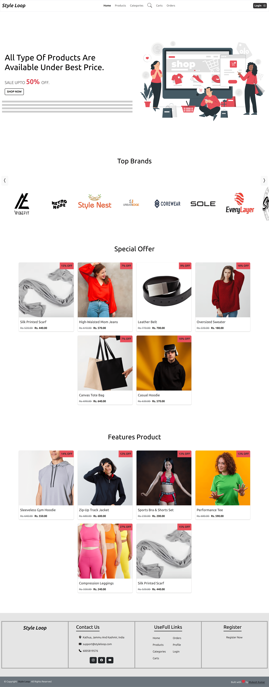
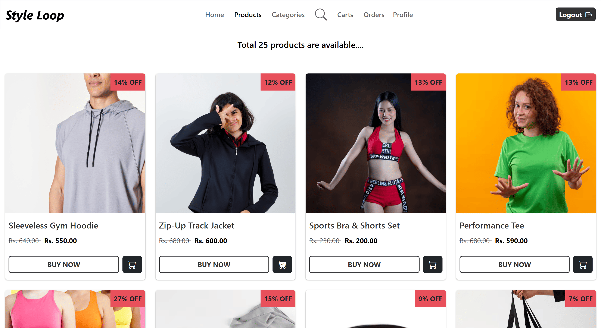
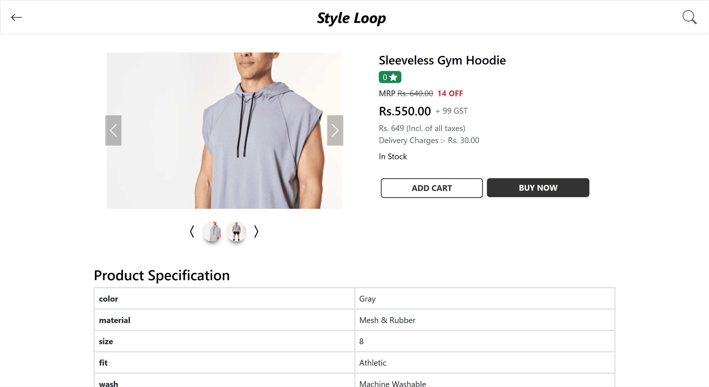
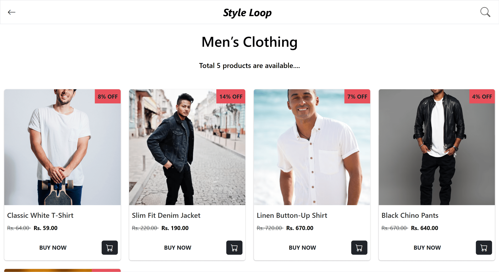
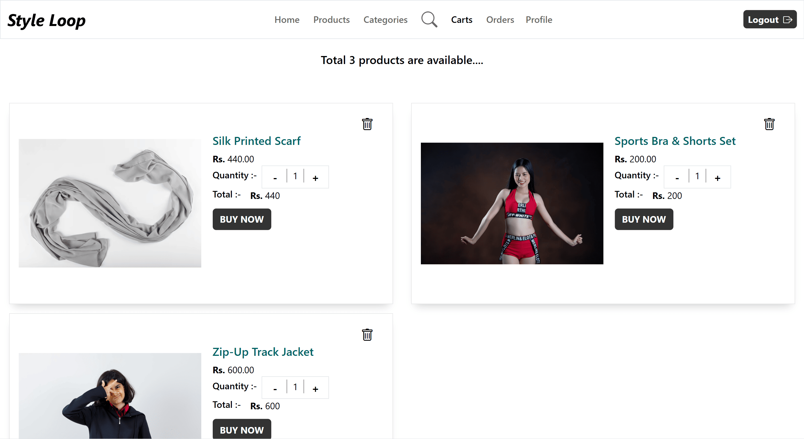
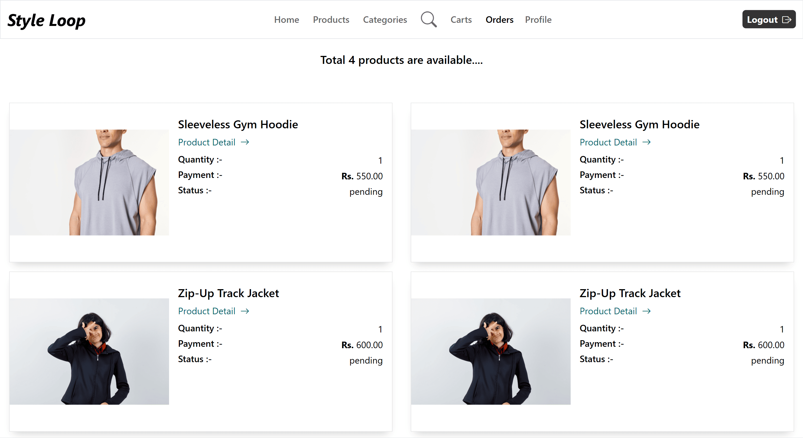
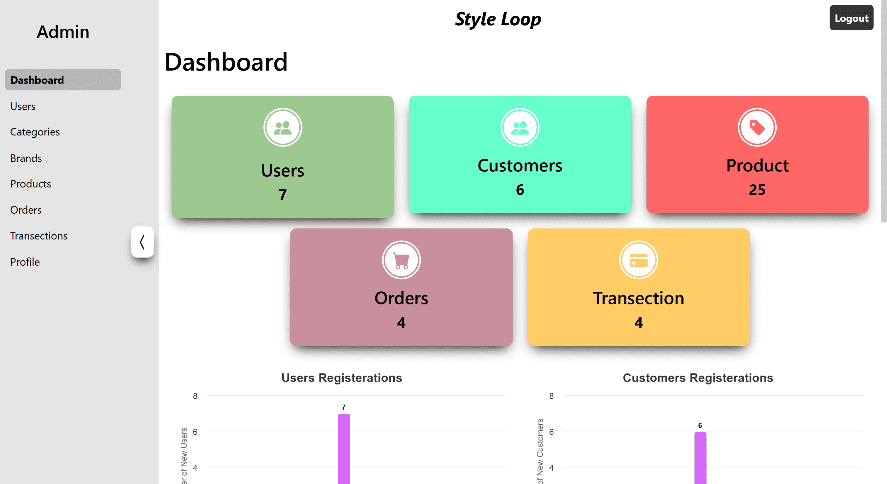
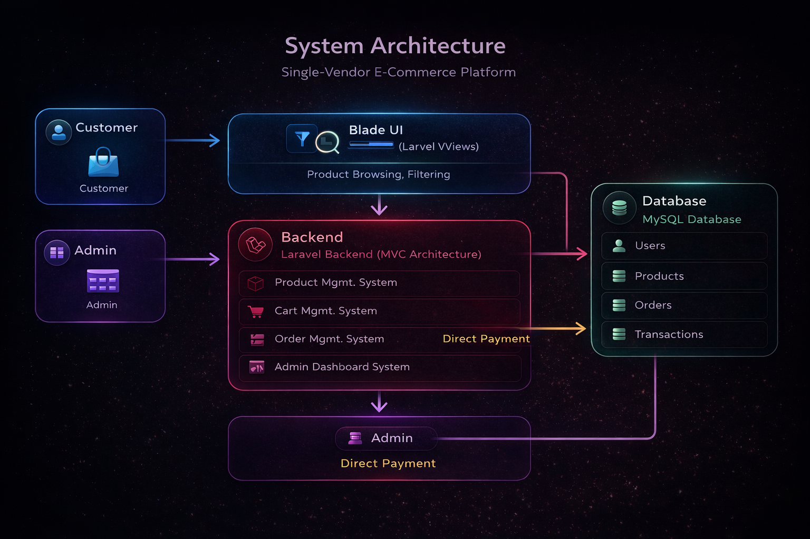

# StyleLoop — Single Vendor E-Commerce Platform

StyleLoop is a full-stack single-vendor e-commerce platform designed to manage complete online shopping workflows including product browsing, cart management, payments, order tracking, and centralized administration.

The platform allows customers to explore products, place orders, and track purchases, while administrators manage inventory, users, transactions, and order operations through a centralized management system.

> Built independently as a complete end-to-end e-commerce platform.

---

## 🌐 Live Demo

🔗 Demo: https://styleloop.page.gd

---

## 📸 Screenshots

### Landing Page


### Product Listing


### Product Details


### Category Browsing


### Shopping Cart


### Order Management


### Admin Management


---

## 🧠 Architecture Diagram

<p align="center">
  
</p>

---

## 🚀 Features

### Customer Features
- Browse featured and latest products
- Explore category-based product listings
- Search and discover products
- View detailed product information
- Add and manage products in cart
- Place orders through integrated payment flow
- Track order status and purchase history

---

### Product & Catalog Features
- Category-based product organization
- Structured product listing system
- Product detail pages with pricing and information
- Search and filtering functionality

---

### Admin Features
- Manage products and categories
- Add, update, and delete products
- Manage users and customer accounts
- Track orders and transactions
- Update order and delivery status
- Monitor platform operations

---

## 💳 Payment Workflow

The platform follows a direct payment flow:

1. Customer places an order and completes payment
2. Payment is received directly by the admin
3. Admin manages order processing and delivery tracking
4. Transactions and order history are maintained within the platform

---

## 🏗️ Project Overview

StyleLoop was designed as a centralized single-vendor e-commerce platform focused on providing a smooth shopping experience while maintaining structured product and order management.

The application supports:
- product discovery and browsing
- cart and checkout workflows
- order tracking and transaction management
- centralized administration and inventory control

The platform focuses more on backend workflows, business logic, and system architecture rather than advanced UI complexity.

---

## 🧠 System Architecture

StyleLoop follows a modular Laravel MVC architecture with centralized business logic and structured data management.

### Frontend
- React.js
- Bootstrap
- JavaScript

### Backend
- Laravel
- MVC Architecture
- Eloquent ORM

### Database
- MySQL
- PostgreSQL

### Deployment
- InfinityFree cPanel Hosting
- phpMyAdmin
- Environment-based configuration

---

## ⚙️ Tech Stack

### Frontend
- React.js
- Bootstrap
- JavaScript

### Backend
- Laravel
- PHP
- Eloquent ORM

### Database
- MySQL
- PostgreSQL

### Infrastructure
- InfinityFree Hosting
- cPanel
- phpMyAdmin

---

## 🧩 Core Systems

### Product Management System
- Product creation and updates
- Category organization
- Product listing management
- Product detail handling

---

### Cart & Checkout System
- Add/remove products from cart
- Cart state management
- Checkout workflow
- Payment processing integration

---

### Order Management System
- Order placement and tracking
- Transaction history
- Delivery status updates
- Admin-controlled order operations

---

### Admin Management System
- User management
- Product management
- Category management
- Transaction monitoring
- Order lifecycle control

---

### Search & Filtering System
- Product search functionality
- Category filtering
- Optimized product retrieval
- Structured browsing experience

---

## 🧠 Technical Challenges Solved

### Designing Cart & Order Workflow
Implemented structured cart and order handling to maintain consistency across checkout and transaction flow.

### Managing Centralized Admin Operations
Built a centralized management system for products, users, orders, and transactions.

### Optimizing Product Listing & Filtering
Implemented optimized database queries for scalable product browsing and category filtering.

### Maintaining Relational Data Consistency
Designed normalized database relationships between products, users, orders, and transactions.

---

## 📁 Project Structure

```bash
E-commerse/
├── app/
├── bootstrap/
├── config/
├── database/
├── public/
├── resources/
│   ├── js/
│   ├── views/
│   └── css/
├── routes/
├── storage/
└── tests/
```

---

## 🛠️ Installation

### Clone Repository

```bash
git clone https://github.com/thappamkkumar/E-commerse.git
```

---

### Backend Setup

```bash
composer install
cp .env.example .env
php artisan key:generate
```

Configure database credentials in `.env`

Run migrations:

```bash
php artisan migrate
```

Start development server:

```bash
php artisan serve
```

---

### Frontend Setup

Install dependencies:

```bash
npm install
```

Compile frontend assets:

```bash
npm run dev
```

---

## 🔐 Authentication & Authorization

- Customer authentication system
- Admin access control
- Protected management routes
- Secure order workflows

---

## 📈 Engineering Highlights

- Independently built complete e-commerce platform
- Designed structured shopping and order workflows
- Implemented cart and transaction management systems
- Built centralized admin management architecture
- Structured scalable relational database design
- Managed deployment and hosting configuration
- Focused on backend logic and marketplace workflows

---

## 📌 Future Improvements

- Advanced UI redesign
- Real-time order updates
- Notification system
- Redis caching
- Recommendation system
- Docker-based deployment
- Analytics dashboard

---

## 👨‍💻 Author

Mukesh Kumar

- Portfolio: https://mukeshkumar.vercel.app/
- GitHub: https://github.com/thappamkkumar
